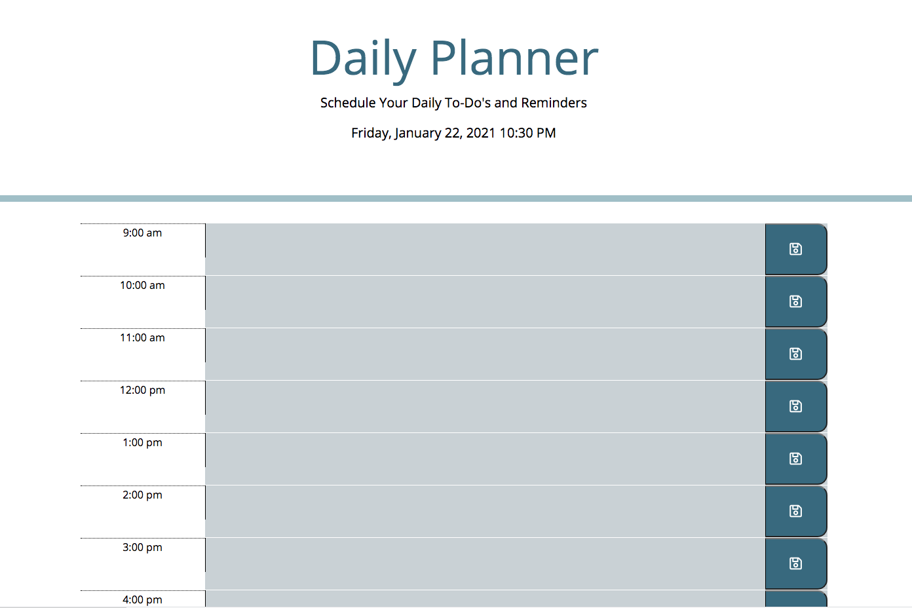

# Daily_Planner

Create a useable daily planner where entries and reminders can be stored 

## Table of Contents
* [Add Links into the HTML file](#Add-links-into-the-HTML-file)
* [Add External CSS & JS Files](#Add-external-CSS-and-JS-files)
* [Create a Functional Home Page](#Create-a-functional-home-page-with-an-hourly-calender)
* [Providing a URL for the Website](#Providing-a-URL-for-the-Website)
* [Credits](#Credits)

## Add Links into the HTML file
1. Add Bootstrap Reference Links for CSS and JS from the getbootstrap webpage
2. Add in the jQuery links
3. Add in Google Fonts link
4. Add in the Font Awesome link for the save button icon

## Add external CSS and JS files
1. Create and add the external CSS style sheet to the index.html file
2. Create and add the script tag for the JS file to the index.html file

## Create a functional home page with an hourly calender
1. Use jQuery to create a fully functional home page with time blocks from 9 a.m. to 5 p.m. where a user can input reminders or daily to dos.
2. Allow the user to save the data they input to the daily calender by saving it to local storage 

## Providing a URL for the website
1. Open Github.com
2. Create a new repository
3. Add a repository name and optional description
4. Make the repo public and add a README
5. Create repository
6. Inside the repo go to settings, scroll down to GitHub Pages and publish your site to the Branch: main

[GitHub Live Site](https://marisanesmith.github.io/Daily_Planner/)

## Credits

* William Chenausky (https://github.com/wchenausky)
* Ethan Dutcher (https://github.com/edutcher)
* W3 Schools (https://w3schools.com)